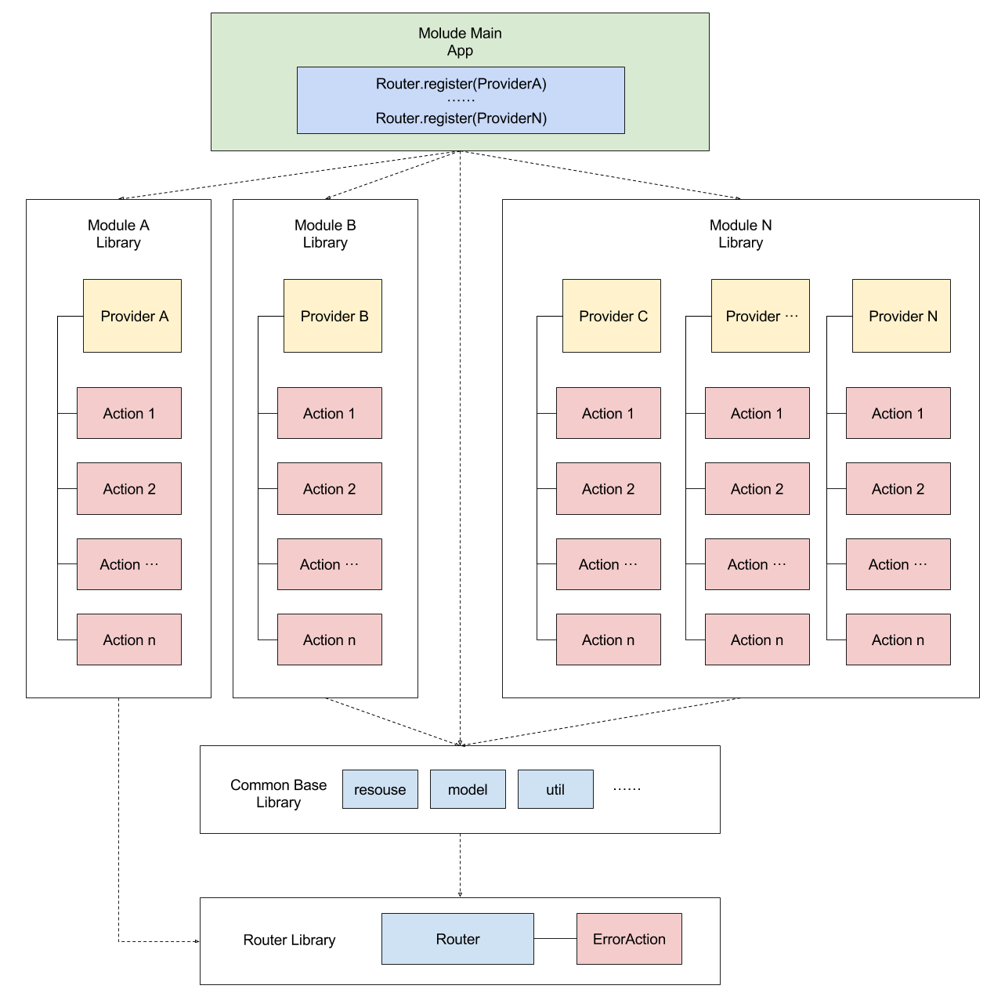

# GenericModuleRouter
泛化模块路由，支持在各种SDK产品中使用（源码拷贝更新applicationId即可，内部可自由增加订制化内容）
#说明
 本项目基于ModularizationArchitecture，在其基础上进行了精简：
 - 去掉了同步异步调用
 Router只负责做好解耦和转发工作，剩余的线程切换、同步异步看业务需要，在分发到业务之后，由具体业务操作线程同步异步。
 - 去掉了跨进程组件
 1. 作为通用SDK内部嵌入的Router较少用到跨进程，如果需要在主进程分发处做进程切换
 2. 此模块只有Jar包，不用在manifet声明任何组件，直接使用即可，无任何依赖。
 - 一切目标为了精简，适合SDK产品使用
 
 ## 整体架构参照
 
 

## 使用方式

- App：可运行的APP Module
- Library Moudule：模块化中的单一业务或功能组件
- Action：跨模块调用的具体实现
- ActionResult：Action调用后返回的结果
- Provider：Action簇，将一组Action放到一起，便于注册
- RouterRequest：调用Action时的请求信息
- RouterResponse：Action调用完成之后的响应信息
- LocalRouter：单进程本地局域路由器

### 1.在Application oncreate中初始化Router

        // 注册Router
        RouterManager.getInstance().registerApplicationLogic(MainApplicationLogic.class);
        RouterManager.getInstance().registerApplicationLogic(WebApplicationLogic.class);
        RouterManager.getInstance().registerApplicationLogic(MusicApplicationLogic.class);
        RouterManager.getInstance().registerApplicationLogic(PicApplicationLogic.class);
        // 初始化Router
        RouterManager.getInstance().init(this);

###2. 创建自定义ApplicationLogic

        public class CustomApplicationLogic extends BaseApplicationLogic {
            @Override
            public void onCreate() {
                // 注册Provider，详见2.4
                LocalRouter.getInstance(mApplication).registerProvider("util",new UtilProvider());
            }
            }

###3. 创建Provider

        public class UtilProvider extends MaProvider {
            @Override
            protected void registerActions() {
                registerAction("md5",new MD5EncryptAction());
            }
        }

###4.实现Action
        
        public class PlayAction implements RouterAction {
        
            @Override
            public void invoke(Context context, HashMap requestData, RouterCallback callback) {
                Intent intent = new Intent(context, MusicService.class);
                intent.putExtra("command", "play");
                context.startService(intent);
                if (callback != null) {
                    HashMap result = new HashMap();
                    result.put(RouterCallback.KEY_VALUE,"play success");
                    callback.onResult(RouterCallback.CODE_SUCCESS,result);
                }
            }
        
        }

###5.调用
        RouterManager.getInstance().route(context, routerRequestBuilder);
## Other
参照ModularizationArchitecture，有兴趣的参见如下传送门

[ModularizationArchitecture](https://github.com/tianfengjingjing/ModularizationArchitecture)

[Android架构思考](http://blog.spinytech.com/2016/12/28/android_modularization/)

[开始使用](http://blog.spinytech.com/2017/02/01/ma_get_start_cn/)

[Getting Start](http://blog.spinytech.com/2017/02/03/ma_get_start_en/)

## License

    Licensed under the Apache License, Version 2.0 (the "License");
    you may not use this file except in compliance with the License.
    You may obtain a copy of the License at

       http://www.apache.org/licenses/LICENSE-2.0

    Unless required by applicable law or agreed to in writing, software
    distributed under the License is distributed on an "AS IS" BASIS,
    WITHOUT WARRANTIES OR CONDITIONS OF ANY KIND, either express or implied.
    See the License for the specific language governing permissions and
    limitations under the License.

